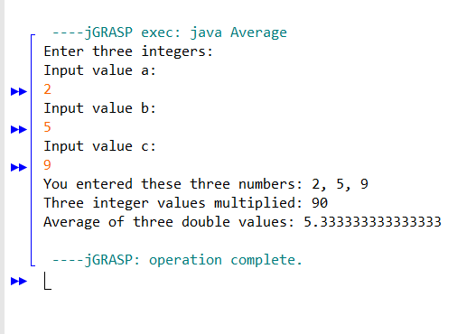
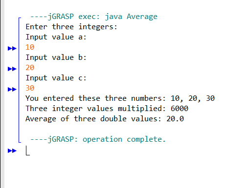
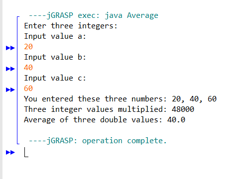

# Average Program

### Task 1

Take input from user to provide 3 numbers.

### Task 2

Display the three numbers multiplied together.
Add the three provided numbers together and calculate the average.

### Task 3

Display the result back to the user

### Results:

